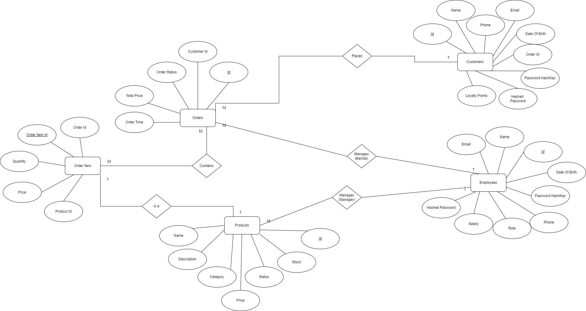

# COFFEE STORE MANAGEMENT

## Overview

Coffee Shop Management System is a web-based backend application using ASP.NET Core Web API for creating RESTful services. It aims to provide functionalities for managing customers, employees, products, and orders in a coffee store. The application utilizes Entity Framework Core for data management, a Service layer for business logic, and incorporates JSON Web Tokens (JWT) for authentication. API documentation can be created through Swagger and Postman.

## ER Diagram


## Table of Contents
- [Coffee Store Management Application](#coffee-store-management)
  - [Overview](#overview)
  - [ER Diagram](#er-diagram)
  - [Table of Contents](#table-of-contents)
  - [Expected Features](#expected-features)
    - [Customer Management](#user-management)
    - [Employee Management](#student-management)
    - [Order Management](#faculty-management)
    - [Product Management](#course-management)
  - [Technologies Used](#technologies-used)
  - [Project Structure](#project-structure)
  - [Getting Started](#getting-started)
    - [Prerequisites](#prerequisites)
    - [Installation](#installation)
    - [Configuration](#configuration)
    - [Running the Application](#running-the-application)
  - [API Endpoints](#api-endpoints)
    - [Auth Endpoints](#auth-endpoints)
    - [Customer Endpoints](#student-endpoints)
    - [Employee Endpoints](#faculty-endpoints)
    - [Order Endpoints](#course-endpoints)
    - [Product Endpoints](#exam-endpoints)
  - [Testing](#testing)
    - [Running Tests](#running-tests)
    - [Coverage Report](#coverage-report)
  - [Relevant Repo](#relevant-repo)

## Expected Features

### Customer Management
- **Customer Registration**: Customers can register for a new account by providing necessary details.
- **Customer Login/Sessions**: Customers can log in to their accounts securely, and sessions are handled with JWT tokens. 
- **View All Customer Details**: Admin can view all the customers and their details. 
- **Update Customer Details**: Customers can update their details by providing their ID.

### Employee Management
- **Employee Registration**: Employees can register for a new account by providing necessary details.
- **Employee Login/Sessions**: Employees can log in to their accounts securely, after their accounts have been activated by the admin, and sessions are handled with JWT tokens. 
- **View All Employee Details**: Admin can view all the Employees and their details.
- **Update Employee Details**: Admins can update employee details by providing the employee's ID.

### Product Management
- **Add Product**: Managers and Baristas will add new products.
- **View Product Details**: Users can view details of Products.
- **Update Product Information**: Managers and Baristas can update Product information.
- **Delete Product**: Managers and Baristas can delete(soft delete) a Product.

### Order Management
- **Add Order**: Customers can place new orders once they have logged in.
- **View Order Details**: Customers, Managers and admins can view details of Orders.
- **Update Order Information**: Baristas can update Order information.

### Administrative Functions (Admin User)
- **View All Users**: Admin users can view a list of all registered users(Including customers, managers and baristas).
- **Update Employee Details**: Admins can update employees' details such as salary status etc.,


## Technologies Used
- **ASP.NET Core Web API**
- **Entity Framework Core**
- **SQL Server**
- **JSON Web Tokens (JWT) for authentication**
- **Swagger & Postman for API documentation**


## Project Structure
The project follows a layered architecture to separate concerns and improve maintainability:
- **Controllers**: Handle HTTP requests and responses.
- **Services**: Business logic layer.
- **Repositories**: Data access layer.
- **Models**: Define database entities.
- **DTOs**: Data Transfer Objects for communication between layers.
- **Mappers**: For auto-mapping functionality between DTOs and models.
- **Enums**: Define enumerations used throughout the application.
- **ErrorModels**: Models for error handling and reporting.
- **Migrations**: Database migrations for managing schema changes.
- **Exceptions**: Custom exceptions used in the application.
- **Contexts**: Database context classes for Entity Framework Core.
- **log4net.config**: Configuration file for logging using log4net.
- **Testing**: Contains unit tests for repositories and services.
  - **Repository Tests**
  - **Service Tests**

## Getting Started

### Prerequisites
- [.NET 6 SDK](https://dotnet.microsoft.com/download/dotnet/6.0)
- [SQL Server](https://www.microsoft.com/en-us/sql-server/sql-server-downloads)

### Installation
1. **Clone the Repository**
   ```sh
   git clone https://github.com/ash0306/Backend-MiniProject-Genspark
   cd CoffeeStoreApplicationSolution
   ```

2. **Restore Dependencies**
   ```sh
   dotnet restore
   ```

3. **Update Database**
   ```sh
   dotnet ef database update
   ```

### Configuration
Configure your application settings in `appsettings.json`:
```json
{
  "Logging": {
    "LogLevel": {
      "Default": "Information",
      "Microsoft.AspNetCore": "Warning"
    }
  },
  "ConnectionStrings": {
    "defaultConnection": "<Your MSSQL database connection string>"
  },
  "TokenKey": {
    "JWT": "<Your JWT token>"
  },
  "AllowedHosts": "*"
}

```

### Running the Application
1. **Run the API**
   ```sh
   dotnet run --project CoffeeStoreApplicationSolution
   ```

2. **Access the API**
   Open your browser and navigate to `https://localhost:5228/swagger` to explore the API documentation.

## API Endpoints

Here are all the API endpoints from your Swagger documentation:

### Customer
  - `PUT /api/customer/updateLoyaltyPoints`: Update loyalty points for a customer.
  - `PUT /api/customer/updatePhone`: Update phone number for a customer.
  - `GET /api/customer/getAll`: Get a list of all customers.
  - `GET /api/customer/getById`: Get a customer by their ID.
  - `GET /api/customer/getByEmail`: Get a customer by their email.

### Customer Authentication
  - `POST /api/customer/register`: Register a new customer.
  - `POST /api/customer/login`: Log in an existing customer.

### Customer
  - `GET /api/employee/getAll`: Get a list of all employees.
  - `GET /api/employee/getById`: Get an employee by their ID.
  - `PUT /api/employee/updateSalary`: Update salary for an employee.
  - `PUT /api/employee/activateEmployee`: Activate an employee.
  - `PUT /api/employee/deactivateEmployee`: Deactivate an employee.
  - `GET /api/employee/getAllAdmins`: Get a list of all admin employees.
  - `GET /api/employee/getAllManagers`: Get a list of all manager employees.
  - `GET /api/employee/getAllBaristas`: Get a list of all barista employees.

### Employee Authentication
  - `POST /api/employee/register/admin`: Register a new admin employee.
  - `POST /api/employee/register/manager`: Register a new manager employee.
  - `POST /api/employee/register/barista`: Register a new barista employee.
  - `POST /api/employee/login`: Log in an existing employee.

### Order
  - `POST /api/orders/addOrder`: Add a new order.
  - `POST /api/orders/cancelOrder`: Cancel an existing order.
  - `GET /api/orders/pendingOrders`: Get a list of pending orders.
  - `PUT /api/orders/updateOrderStatus`: Update the status of an order.
  - `GET /api/orders/getOrderByCustomerId`: Get orders by customer ID.
  - `GET /api/orders/getOrderItemsByOrderId`: Get order items by order ID.

### Product
  - `POST /api/product/addProduct`: Add a new product.
  - `GET /api/product/getAllProducts`: Get a list of all products.
  - `GET /api/product/getAvailableProducts`: Get a list of available products.
  - `GET /api/product/getById`: Get a product by its ID.
  - `GET /api/product/getByName`: Get a product by its name.
  - `GET /api/product/getByCategory`: Get products by category.
  - `PUT /api/product/updatePrice`: Update the price of a product.
  - `PUT /api/product/updateStatus`: Update the status of a product.
  - `PUT /api/product/updateStock`: Update the stock of a product.

## Testing
- Unit tests are written using NUnit, Moq for mocking dependencies and In-Memeory datavase for storing data.

- The unit testing for this application can be found in the branch [`unit-testing`](https://github.com/ash0306/Backend-MiniProject-Genspark/tree/unit-testing/CoffeeStoreApplicationSolution/CoffeeStoreUnitTest).

### Running Tests
```sh
dotnet test
```

### Coverage Report
To generate a code coverage report:
```sh
dotnet test /p:CollectCoverage=true
```
